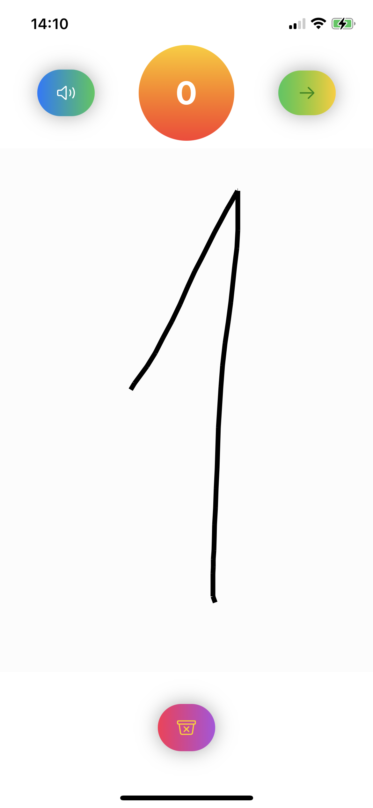

#  Learn Numbers App

The objective of the app: provide a tool for kids to master their handwriting (numbers 0-9). 

The interaction with the app consists of several steps: 
* Get a task to draw a specific number (voice); 
* Draw a number (on a screen);
* Hear the feedback;
* Get info about previous successful attempts (score);

* User can replay the task by clicking on the Play Button;
* User can clean the drawing pad to start over (Start Over Button);
* User can move to the next task by clicking on the Next Button.

UI is intentionally very mimimalistic so kids will focus on the main objective of the app.  \
(Real testers demostraited that even mimimalistic design hasn't stopped yound minds to use the app for other reasons: it is a great drawing tool as well)))

### Views

#### Welcome Screen

[Presentation](https://docs.google.com/presentation/d/1AL1wHtlfOP6GxTJ0PGTGrZhgO_mOZERdVcokmqaUE3U/edit?usp=sharing) \
[VideoDemo](https://youtu.be/KuyFQ83QavY)

[Button Styles](https://thehappyprogrammer.com/custom-buttons-in-swiftui/) \
[Convert Path to Image](https://msapps.mobi/core-graphics-ios/) \
[GraphicRendering](https://developer.apple.com/documentation/uikit/uigraphicsimagerenderer#2863645) \
[Drawing Tool](https://martinmitrevski.com/tag/drawing/) \
[Rotation](https://betterprogramming.pub/how-to-build-a-rotation-animation-in-swiftui-e8fb889ccf7e)
