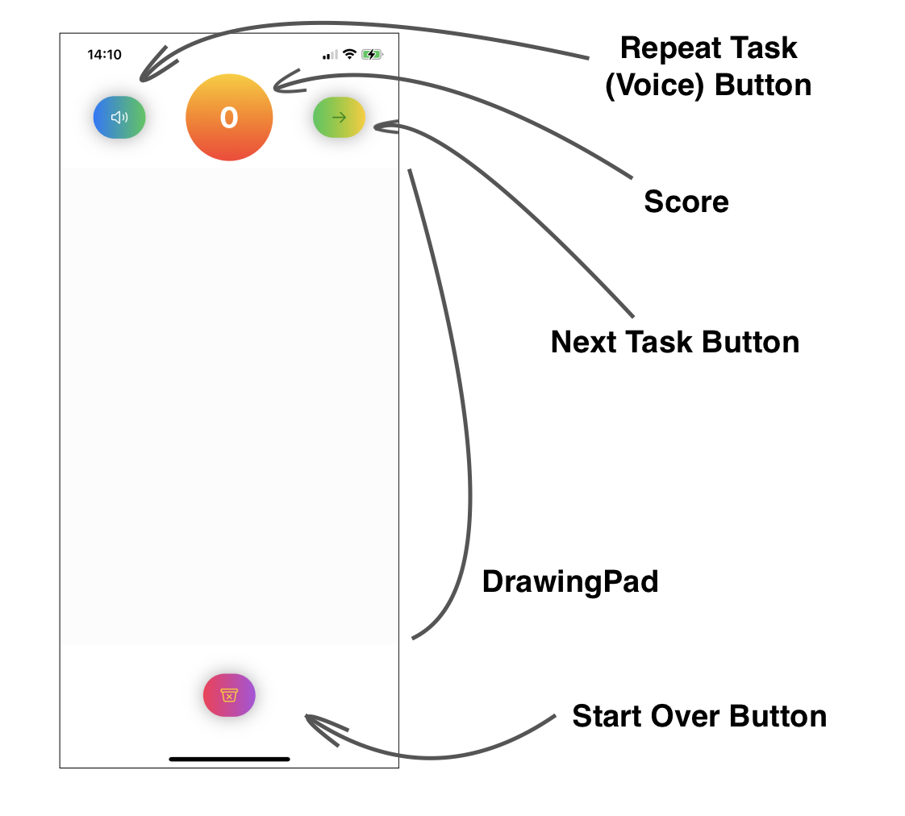

#  Learn Numbers App

The objective of the app: provide a tool for kids to master their handwriting (numbers 0-9). 

The interaction with the app consists of several steps: 
* Get a task to draw a specific number (voice); 
* Draw a number (on a screen);
* Hear the feedback;
* Get info about previous successful attempts (score);

* User can replay the task by clicking on the Play Button;
* User can clean the drawing pad to start over (Start Over Button);
* User can move to the next task by clicking on the Next Button.

UI is intentionally very mimimalistic so kids will focus on the main objective of the app.  \
(Real tester demostraited that even mimimalistic design can't stop young minds from using the app for other reasons: it is a great drawing tool as well)))

This app is based on the build-in on-device iOS CoreML capabilities. 

Main components are: 
* 2 views ([Welcome Screen](./LearnNumbers/ContentView.swift) and [Main Screen](./LearnNumbers/DrawingPad/DrawingTool.swift))
* [DrawingPad](./LearnNumbers/DrawingPad/DrawingPad.swift) that tracks user gestures on the screen and stores all CGPoints in an array
* Drawing to UIImg converter: for the drawing to be processed if should be converted into UIImage: all CGPoints rendered (IGraphicsImageRenderer) on the black blackground using a white stroke that connects them, and then converted to UIImage (located in [CoreMLClassification](./LearnNumbers/ML/CoreMLClassification.swift) as separate function `getImage()`)
* Image Processing: CoreML is used for image processing/classification. The model is MNISTClassifier ([MNIST Handwritten Digit Classification Dataset](http://yann.lecun.com/exdb/mnist/)) [CoreMLClassification](./LearnNumbers/ML/CoreMLClassification.swift)
* Text to Speech converter (AVSpeechUtterance and AVSpeechSynthesizer from AVFoundation) allows to read aloud the task and give feedback. (can be found in [the CoreMLClassification class]((./LearnNumbers/ML/CoreMLClassification.swift)) and on the [MainScreen](./LearnNumbers/DrawingPad/DrawingTool.swift))
* Various customised [buttons](./LearnNumbers/Buttons/)

### Presentation and Demo

[Presentation](https://docs.google.com/presentation/d/1AL1wHtlfOP6GxTJ0PGTGrZhgO_mOZERdVcokmqaUE3U/edit?usp=sharing) \
[VideoDemo](https://youtu.be/KuyFQ83QavY)

### References
1. 277 Lectures [lectures 8-11, 14]
1. [CoreML Models](https://developer.apple.com/machine-learning/models/)
2. [Button Styles](https://thehappyprogrammer.com/custom-buttons-in-swiftui/) 
3. [Convert Path to Image](https://msapps.mobi/core-graphics-ios/) 
4. [GraphicRendering](https://developer.apple.com/documentation/uikit/uigraphicsimagerenderer#2863645) 
5. [Drawing Tool](https://martinmitrevski.com/tag/drawing/) 
6. [Rotation](https://betterprogramming.pub/how-to-build-a-rotation-animation-in-swiftui-e8fb889ccf7e)

### Views

#### Welcome Screen

#### Main Screen

